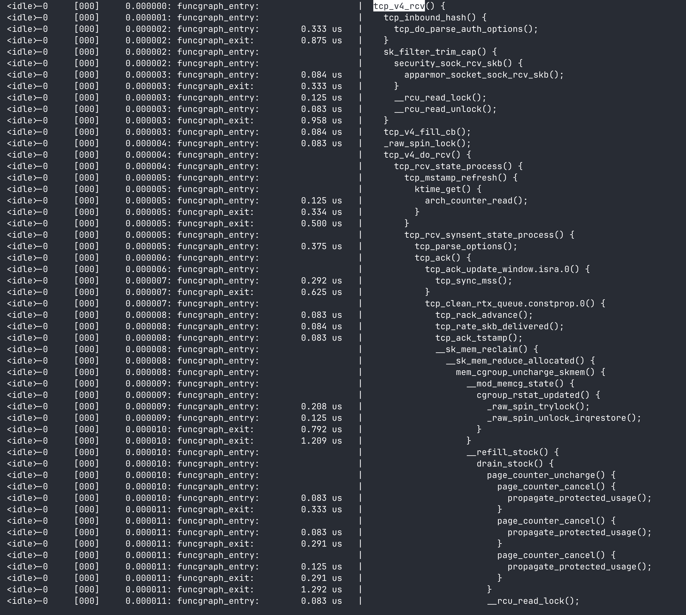
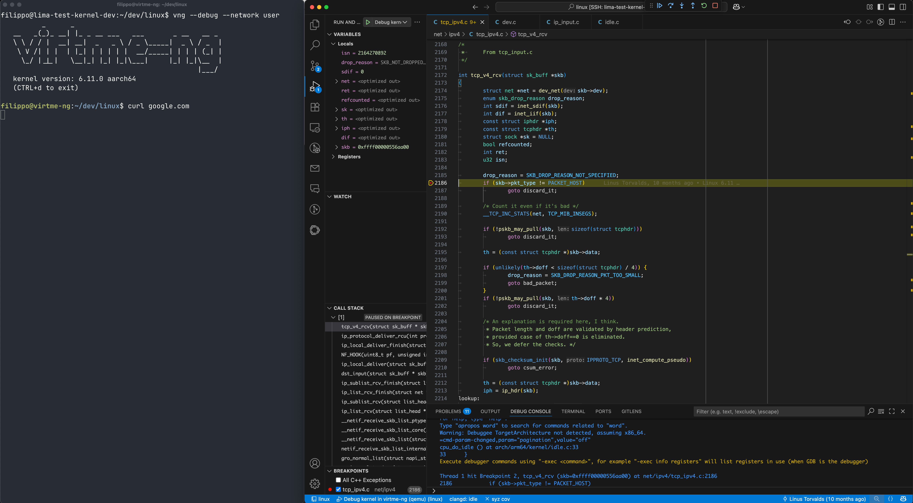
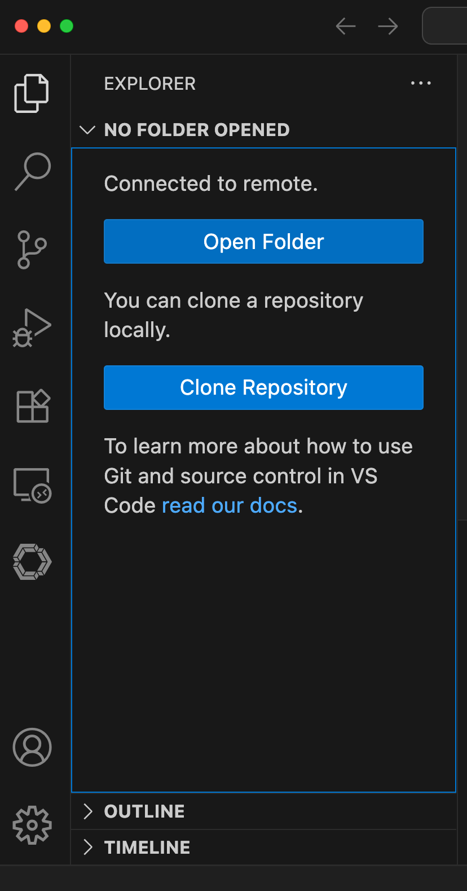
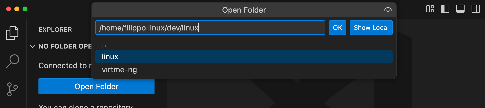

# Linux Kernel Development Environment on Mac using limactl

## Overview

Setup a Linux Kernel development environment on `mac` arm64 processors using [limactl](https://lima-vm.io/docs/reference/limactl/) and based on [FlorentRevest](https://github.com/FlorentRevest/linux-kernel-vscode)'s work.


As an example, given this kernel `trace-cmd` function graph:



It will then be possible to debug the flow in [net/ipv4/tcp_v4.c](https://elixir.bootlin.com/linux/v6.11/source/net/ipv4/tcp_ipv4.c#L2172) with a breakpoint using Visual Studio Code - on your arm64 mac:

 

## Prerequisites

- an arm64 mac
-  [limactl](https://lima-vm.io/docs/reference/limactl/)
- 8GB memory for the lima vm
- 50GB free disk

## Setup

```
./setup_kernel_dev_env.sh
```

The command will:
- create a `vm` using `lima`
  - install all the required dependencies in the `lima vm` as per [installation_steps.sh](installation_steps.sh)
    - libraries for building the kernel
    - [virtme-ng](https://github.com/arighi/virtme-ng): easily start the compiled kernel with qemu
  -   clone the kernel sources in `$HOME/dev/linux`  
  -   build the kernel using clang and `$HOME/dev/linux/vmlinux`

Example run [video](docs/launch_script_x10.mp4)


### Configuration

Default values

```
VM_NAME=kernel-dev-vm
VM_TEMPLATE=ubuntu-24.10
VM_CPUS=6
VM_MEMORY_GB=8
VM_DISK_GB=50
```

can be changed by passing any of the above `env` variables

e.g.
```
VM_NAME=another_name VM_CPUS=4 ./setup_kernel_dev_env.sh
```


## VM is ready, what next?

Once the script has completed successfully, you can familiarise with the kernel by adding a breakpoint and see the kernel in action.


## Debugging using Visual Studio Code

Please refer to this [video](docs/debug_with_visual_studio-code.mp4) for step-by-step instructions

### Launch Visual Studio Code

#### Add a new remote connection

```
# retrieve the SSH Connection Command to paste in VSCode
limactl show-ssh $VM_NAME
```

### Configure the remote

####  open folder
</image>

#### select dev/linux




### Find an interesting break point by looking at the net_rx_action function graph

Let's find a break point in the networking stack by running a `trace-cmd`
on [net_rx_action](https://tldp.org/HOWTO/KernelAnalysis-HOWTO-8.html)

Log into the VM:
```
limactl shell --workdir "/tmp" $VM_NAME
```

record the function graph trace for net_rx_action

```
sudo trace-cmd record \
    -p function_graph \
    -g net_rx_action   \
    -- curl -s -o /dev/null https://example.com
```

and then display the call-graph

```
sudo trace-cmd report --align-ts| less
```

and you'll see something like:
```
          <idle>-0     [000]     0.151699: funcgraph_entry:                   |                        tcp_v4_rcv() {
          <idle>-0     [000]     0.151699: funcgraph_entry:                   |                          tcp_inbound_hash() {
          <idle>-0     [000]     0.151700: funcgraph_entry:        0.125 us   |                            tcp_do_parse_auth_options();
          <idle>-0     [000]     0.151700: funcgraph_exit:         0.292 us   |                          }
          <idle>-0     [000]     0.151700: funcgraph_entry:                   |                          sk_filter_trim_cap() {
          <idle>-0     [000]     0.151700: funcgraph_entry:                   |                            security_sock_rcv_skb() {
          <idle>-0     [000]     0.151701: funcgraph_entry:        0.167 us   |                              apparmor_socket_sock_rcv_skb();
          <idle>-0     [000]     0.151701: funcgraph_exit:         0.792 us   |                            }
          <idle>-0     [000]     0.151701: funcgraph_entry:        0.083 us   |                            __rcu_read_lock();
          <idle>-0     [000]     0.151701: funcgraph_entry:        0.083 us   |                            __rcu_read_unlock();
          <idle>-0     [000]     0.151701: funcgraph_exit:         1.584 us   |                          }
          <idle>-0     [000]     0.151702: funcgraph_entry:        0.083 us   |                          tcp_v4_fill_cb();
          <idle>-0     [000]     0.151702: funcgraph_entry:        0.083 us   |                          _raw_spin_lock();
          <idle>-0     [000]     0.151702: funcgraph_entry:                   |                          tcp_v4_do_rcv() {
          <idle>-0     [000]     0.151702: funcgraph_entry:                   |                            tcp_rcv_state_process() {
          <idle>-0     [000]     0.151702: funcgraph_entry:                   |                              tcp_mstamp_refresh() {
          <idle>-0     [000]     0.151702: funcgraph_entry:                   |                                ktime_get() {
          <idle>-0     [000]     0.151702: funcgraph_entry:        0.083 us   |                                  arch_counter_read();
          <idle>-0     [000]     0.151703: funcgraph_exit:         0.209 us   |                                }
          <idle>-0     [000]     0.151703: funcgraph_exit:         0.333 us   |                              }
          <idle>-0     [000]     0.151703: func
cpus=6
```

`tcp_v4_rcv` is an interesting entry point to debug the tcp stack, located at [net/ipv4/tcp_v4.c](https://elixir.bootlin.com/linux/v6.11/source/net/ipv4/tcp_ipv4.c#L2172)


### Launch virtme-ng in debug mode

Log into the VM:
```
limactl shell --workdir "/tmp" $VM_NAME
```

Launch virtme-ng in debug mode
```
cd ~/dev/linux
vng --debug --network user
```

A qemu instance is launched starting up the linux kernel we have just built, with debug port open on localhost:1234

### Start debugging from VSCode

Launch the `Debug kernel in virtme-ng (qemu)` debug configuration in VSCode